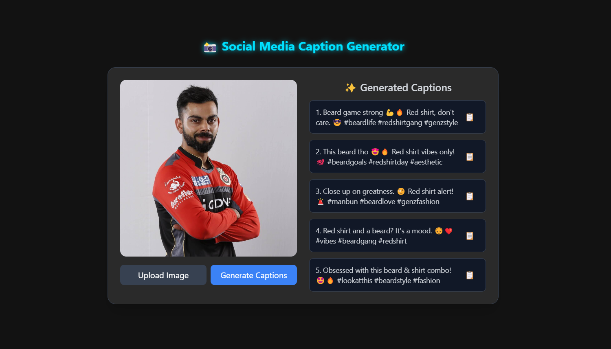

# 📸 Social Media Caption Generator

## 🚀 Overview
This project is a **Social Media Caption Generator** that generates engaging Instagram captions based on uploaded images. It uses:
- **BLIP (Bootstrapped Language-Image Pretraining)** for image captioning
- **Gemini AI** to enhance the caption for social media
- **FastAPI** backend to process images and generate captions
- **Frontend** built with HTML, TailwindCSS, and JavaScript

## 🎥 Website Preview


## 🛠️ Features
- Upload an image via the frontend
- BLIP model generates a caption
- Gemini AI refines the caption into five social media-friendly versions
- Copy captions to clipboard with one click

## 🏗️ Tech Stack
- **Backend:** FastAPI, BLIP, Gemini AI
- **Frontend:** HTML, TailwindCSS, JavaScript

## 📥 Installation & Setup
### 1️⃣ Clone the repository
```sh
git clone https://github.com/yourusername/social-media-caption-generator.git
cd social-media-caption-generator
```

### 2️⃣ Create a virtual environment & install dependencies
```sh
python -m venv venv
source venv/bin/activate  # On Windows use `venv\Scripts\activate`
pip install -r requirements.txt
```

### 3️⃣ Set up Google Gemini API Key
Create a `.env` file and add your **Google Gemini API Key**:
```
GEMINI_API_KEY=your_api_key_here
```

### 4️⃣ Run FastAPI Server
```sh
uvicorn main:app --reload
```

### 5️⃣ Open the Frontend
Just open `index.html` in a browser or run a simple HTTP server:
```sh
python -m http.server 5500
```
Then go to `http://127.0.0.1:5500`.

## 🖼️ API Endpoints
### 🔹 Generate Captions
**Endpoint:** `POST /generate-captions/`
**Request:**
```sh
curl -X POST "http://127.0.0.1:8000/generate-captions/" -F "file=@image.jpg"
```
**Response:**
```json
{
  "original_caption": "A beautiful sunset over the beach.",
  "instagram_captions": [
    "🌅 Chasing sunsets and dreams! #BeachVibes",
    "Golden hour magic! ✨ #SunsetGoals",
    "No filter needed! 🌞 #OceanLove"
  ]
}
```

## 🔧 Troubleshooting
### Backend not running?
- Ensure you activated the virtual environment (`venv`)
- Check if `uvicorn` is installed (`pip install uvicorn`)

### Frontend not connecting?
- Ensure FastAPI server is running on `127.0.0.1:8000`
- Open the frontend using `http://127.0.0.1:5500`

## 📜 License
MIT License

---
Made with ❤️ by **Aniruddha Kide**

